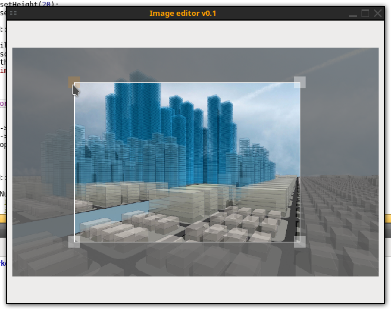

# Example

ui->widget->setCropMode( false );
ui->widget->setImage( "://ico.png" );
ui->widget->setLayerHSV( 1, 0, 0, value );

auto img = ui->widget->getImage();
img.save( "sprite.png", "PNG", 100 );

ui->widget->setLayersCount( 2 );
ui->widget->setImage( "../Horse.png" );
ui->widget->setImage( "../1.png", 1 );
ui->widget->update();

### Screenshoot

